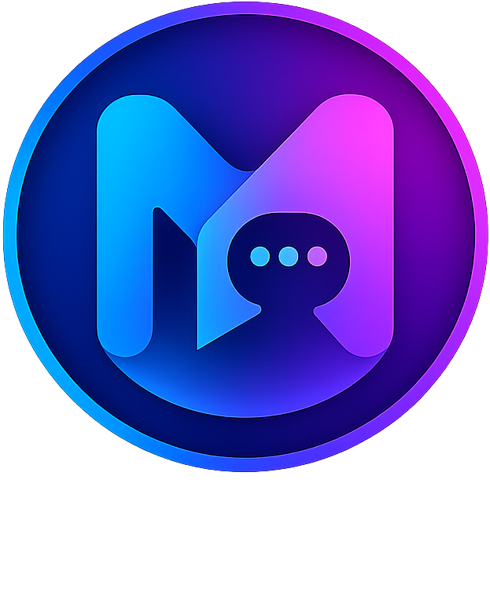
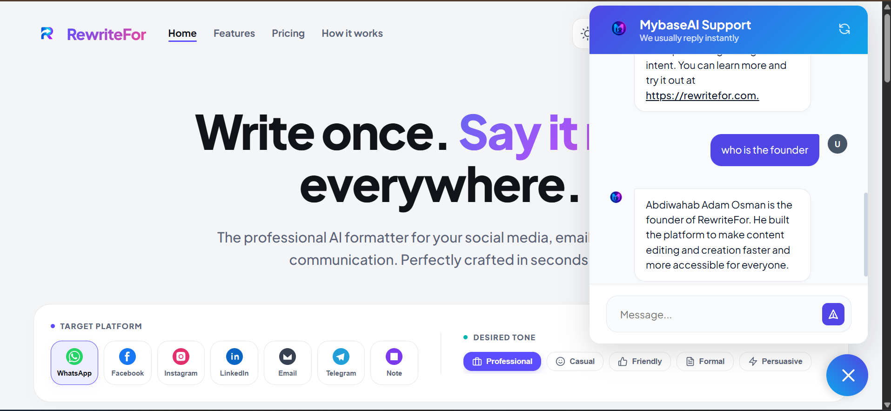

<div align="center">
  
  <h1>MybaseAI</h1>
  <p><strong>A Multi-Tenant AI Knowledge Base & Customer Support Platform</strong></p>
  <p>🌍 <strong><a href="https://mybaseai.onrender.com/">Live Demo</a></strong></p>
  
  <br>
  
</div>

---

## 🚀 What is MybaseAI?

MybaseAI is a fully functional, multi-tenant SaaS application that allows businesses to instantly create customized, intelligent AI customer support chatbots based on their own proprietary data. 

Instead of relying on generic AI, companies can securely upload their internal documents, PDFs, and training manuals. MybaseAI processes these documents, stores them in an isolated vector database, and deploys a custom chatbot that strictly answers questions based *only* on the provided knowledge base.

### ✨ Key Features

- **Multi-Tenant Architecture:** Total data isolation. Each registered company has its own isolated vector database and chat history.
- **Retrieval-Augmented Generation (RAG):** Powered by Google's cutting-edge **Gemini 2.5 Flash** LLM and Gemini Embeddings for lightning-fast, highly accurate responses.
- **Intelligent Knowledge Parsing:** Automatically chunks and vectorizes uploaded PDFs using LangChain and Supabase PGVector.
- **Custom API Key Control:** System default API key provided, with the ability for power-users to seamlessly plug in their own Gemini API key via the settings panel to bypass system quotas.
- **Passwordless Authentication:** Frictionless "Sign in with Google" OAuth integration.
- **Embedded Widget:** One-click script tag to embed the AI assistant directly into any external company website.
- **Premium Clerk-like UI:** Beautiful, modern, fully responsive dashboard built with vanilla CSS.

## 🛠️ Technology Stack

MybaseAI is built using a modern, scalable, and robust technology stack:

- **Backend:** [Django](https://www.djangoproject.com/) (Python)
- **Database:** [Supabase PostgreSQL](https://supabase.com/)
- **Vector Database:** [Supabase PGVector](https://supabase.com/docs/guides/ai/vector-columns) (Stateless storage directly inside the main Postgres database)
- **AI/LLM Framework:** [LangChain](https://www.langchain.com/)
- **Large Language Model:** [Google Gemini 2.5 Flash](https://ai.google.dev/)
- **Authentication:** `django-allauth` (Google OAuth 2.0)
- **Frontend UI:** HTML5, Vanilla CSS3 (Custom Clerk-inspired design), JavaScript

## 📦 Local Installation

To run MybaseAI locally, follow these steps:

1. **Clone the repository:**
   ```bash
   git clone https://github.com/Abdiwahab23/MyBaseAI.git
   cd MyBaseAI
   ```

2. **Create a virtual environment:**
   ```bash
   python -m venv venv
   source venv/bin/activate  # On Windows use: .\venv\Scripts\activate
   ```

3. **Install dependencies:**
   ```bash
   pip install -r requirements.txt
   ```

4. **Set up Environment Variables:**
   Create a `.env` file in the root directory and add the following keys:
   ```env
   # Database
   DATABASE_URL=postgresql://[user]:[password]@[host]:[port]/[db_name]

   # Google API Keys
   GEMINI_API_KEY=your_gemini_api_key

   # Google OAuth Credentials
   GOOGLE_CLIENT_ID=your_oauth_client_id
   GOOGLE_CLIENT_SECRET=your_oauth_client_secret
   ```

5. **Run Migrations:**
   ```bash
   python manage.py makemigrations
   python manage.py migrate
   ```

6. **Start the Development Server:**
   ```bash
   python manage.py runserver
   ```
   *Navigate to `http://127.0.0.1:8000` in your browser.*

